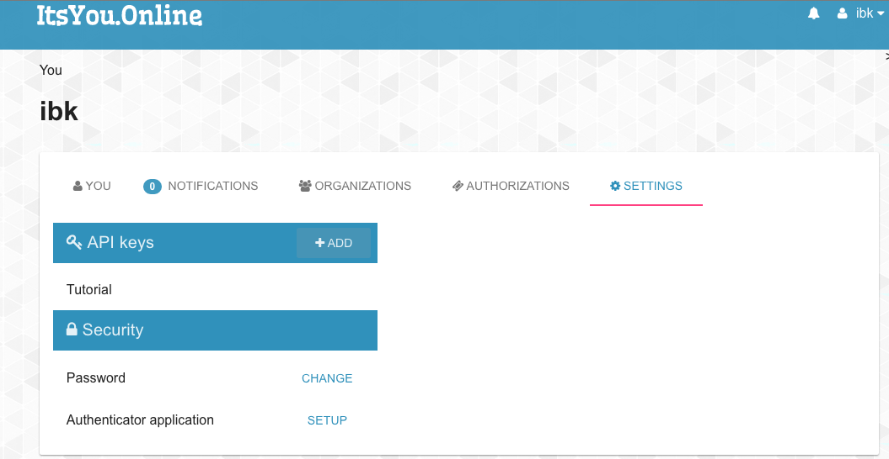
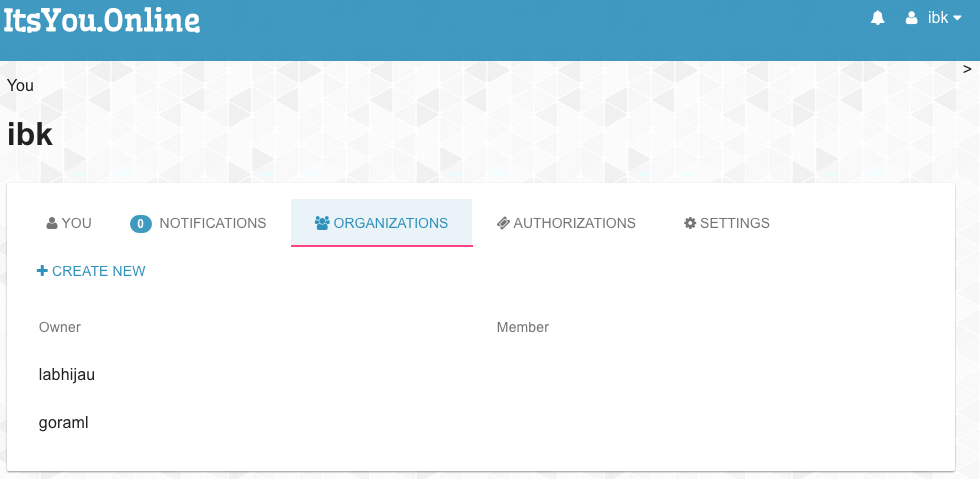
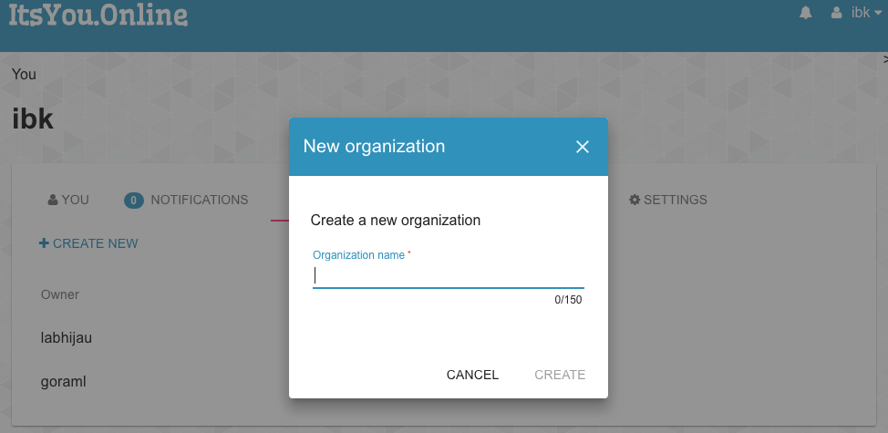

# go-raml Tutorial

In this tutorial, we will show you how to:

- getting started with RAML and it's editor
- generate Go server & client from an RAML file
- generate Python server & client fron an RAML file
- integrate Go & Python server with oauth2 server, we use [itsyou.online](https://www.itsyou.online/) as example.
- accessing auto generated API Docs

We will call the generated application as `goramldir`.
It is a simple server for `go-raml` developer database directory.
A user with approriate access right could do these things:

- add a developer to `goramldir` database
- get lisf of all `go-raml` developer
- get details of a `go-raml` developer

## Getting Started

In this section, we give short intro to RAML and it's editor.

1. RAML specification can be found in [RAML 1.0 spec page](http://raml.org/raml-10-spec), if you want to contribute
  you can find the repo at github https://github.com/raml-org/raml-spec

2. Online RAML editor
   
  Online RAML editor can be found in [Anypoint Mulesoft webpage](https://anypoint.mulesoft.com/apiplatform/):
  
  - Go to https://anypoint.mulesoft.com/apiplatform/
  - Press `sign up` button and follow the procedure
  - Press `Add New API` button
  - To define your API, press ` Define API in API designer` link 
   

3. API Workbench as RAML editor

  [API Workbench](http://apiworkbench.com/) is recommended RAML editor. Installation steps:
  
  - Install (Atom)[https://atom.io/)
  - Open "Settings" and "Install Packages", Search for `api-workbench`.

4. API Designed as RAML web editor

  [API Designer](https://github.com/mulesoft/api-designer) is a standalone/embeddable editor for RAML written in JavaScript using Angular.JS.
  By default, the editor uses an in-browser filesystem stored in HTML5 Localstorage.
  
  Installation steps:
  
  - Install NPM by following guide in this [page](https://docs.npmjs.com/getting-started/installing-node).
  - Install api designer : `npm install -g api-designer`
  - run it : `api-designer`

## itsyou.online Oauth2 integration

We will use itsyou.online [JWT support](https://gig.gitbooks.io/itsyouonline/content/oauth2/jwt.html)
for our oauth2 integration.

A short description about the integrations:

- Client acquire oauth2 token using [Client Credential Flow](https://gig.gitbooks.io/itsyouonline/content/oauth2/oauth2.html)
- Client generate JWT Token by specifying the scopes. We will use `Organization` as the scopes.
  We can see more about scope in [Scope Concept](https://gig.gitbooks.io/itsyouonline/content/oauth2/scopes.html) and
  [Available Scopes](https://gig.gitbooks.io/itsyouonline/content/oauth2/availableScopes.html)
- Client use JWT token to authorize the request
- Server decode JWT token and check if the scopes match.

**Get itsyouonline API Key**

For itsyou.online oauth2 integration, we need to get itsyou.online API key and secret.

Go to https://www.itsyou.online/ and `Register` if you don't have account there.

After signed in, go to `SETTINGS` tab and add API Key.

**Create itsyouonline organization**

In this tutorial we will use itsyou.online organization feature as a way to authorize the API call.

Go to `ORGANIZATIONS` tab and click `CREATE NEW`.

**Modify the RAML file**

We need to modify the provided [api.raml](api.raml) to fit our newly created organization.

Let's say you just created these two organizations in previous steps:

- XXX
- XXX-admin

Then you need to modify:

- `user:memberof:goraml` to `user:memberof:XXX` and
- `user:memberof:goraml-admin` to `user:memberof:XXX-admin`

## Generate server & client code

Follow below tutorials according to your preferred language:

- [Go tutorial](./go/README.md)
- Python tutorial

Inside above tutorials, there is guide for `itsyou.online` oauth2 integration and how to access auto generated API docs.

