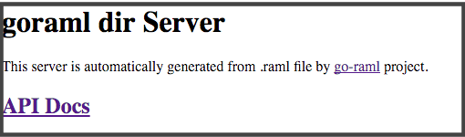
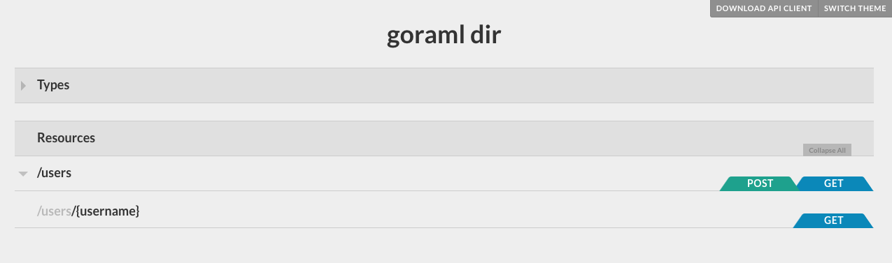
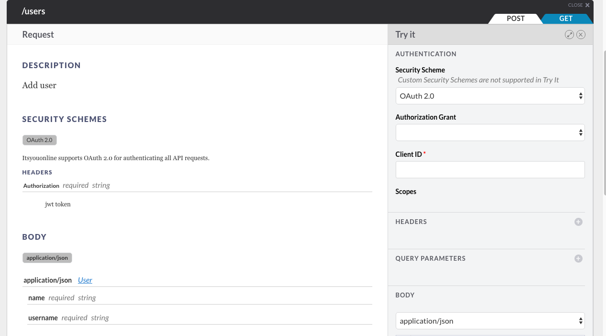

# Go Tutorial

In this tutorial we will generate a simple Go client & server from [an RAML file](../api.raml) and then integrate it
with [itsyou.online](https://www.itsyou.online/) authorization server.

This tutorial use [jumpscale/ubuntu1604_golang](https://hub.docker.com/r/jumpscale/ubuntu1604_golang/) docker image.
But you can use any system with Go installed and configured.

## Create docker instances

You can skip this step if you want to use your own enviroment.

```
sudo docker pull jumpscale/ubuntu1604_golang
sudo docker run --rm -t -i  --name=goraml jumpscale/ubuntu1604_golang
```

## Server

Generate server code by using this command
```
$ go-raml server --ramlfile ../api.raml --import-path examples.com/goramldir --dir $GOPATH/src/examples.com/goramldir
```

You can find all server files in `$GOPATH/src/examples.com/goramldir` directory.


### Server side itsyou.online integration

We need to write/modify some code for this integration

**JWT decoder**

You can find JWT decoder code in [iyo.go](server/iyo.go) and do these:

- modify the package from `iyo` to `main`
- copy `iyo.go` to `$GOPATH/src/examples.com/goramldir` directory

**Oauth2 middleware**

Need to modify ` oauth2_itsyouonline_middleware.go` in `$GOPATH/src/examples.com/goramldir` directory.

Find this line in `func (om *Oauth2itsyouonlineMiddleware) Handler(next http.Handler) http.Handler {`
```
var scopes []string
```
replace it with
```
scopes, err := getIyoUserScope(accessToken)
if err != nil {
    w.WriteHeader(403)
    return
}
```

In `getIyoUserScope` function, you can find code to:

- decode itsyou.online JWT token which require itsyou.online public key
- check if the token issued by itsyou.online
- get the `scopes`

**execute the server**

```
go build
./goramldir
```

## Client

generate client code by using this command

`go-raml client --ramlfile ../api.raml --dir client --package main`

Then you can find client code in `client` directory.

**itsyou.online client library**

We need the library to get oauth2 token and generate JWT token

`go get -u -v github.com/itsyouonline/identityserver/clients/go/itsyouonline`


**simple client main program**

A simple example of the client program can be found in [main.go](client/main.go).

Steps to use generated client lib & itsyou.online client lib:

- create itsyou.online client object
- login to itsyou.online to create oauth2 token
- create itsyou.online JWT token
- create `goramldir` client object
- set JWT token as authorization header

after above steps, client are ready to make API call to `goramldir` server.

The code is relatively simple and have enough comment, so it should be easy to understand. 

** execute client program**

```
go build
./client --app_id=YOUR_APP_ID --app_secret=YOUR_API_KEY
```

## Auto Generated API server homepage & API Docs

`go-raml` generated code also provide you with a simple homepage and auto generated API docs.

To access it, you can visit http://localhost:5000 from your browser



If we click `API Docs`, browser will go to auto generated API docs page



We can click any HTTP verbs in the API Docs page to see documentation for that endpoint & verb.
This is documentation for `POST /users` page


